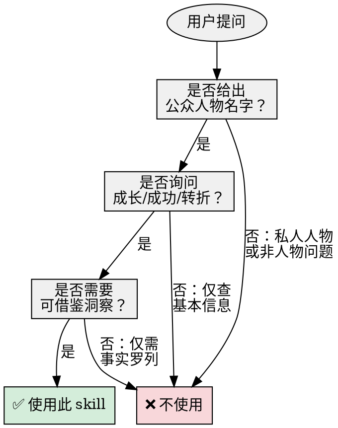
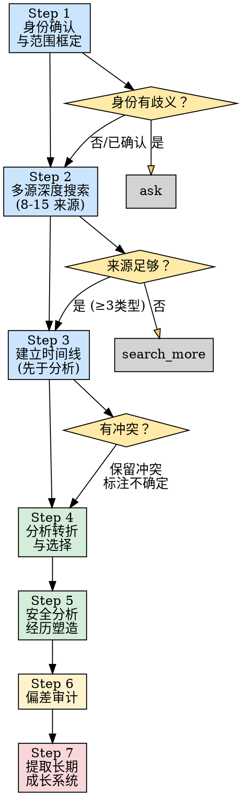

# 📈 Growth Trajectory Research

深度研究成功人士的成长轨迹，分析事业突破与逆境转折，产出可迁移的长期成长系统洞察，而非鸡汤传记。

## 🎯 Core Principle

```
🔍 先研究，再分析
📅 先时间线，再因果
📊 先证据，再启发
⚠️ 没有足够来源支撑的结论，宁可标注不确定，也不编造
```

## ✅ When to Use



**✅ 触发场景：**
- 👤 用户给出一个成功人士的名字，想了解他怎么成功的
- 🔄 用户想分析某人的关键转折、重要选择、逆境经历
- 💡 用户想从成功人士身上提取可借鉴的成长模式

**❌ 不触发场景：**
- 📋 快速查人物基本信息（生日、职位等）
- 🔒 私人/非公众人物（除非用户提供来源）
- 🎭 名人八卦、心理诊断、道德审判
- 🧬 基因家谱调查

## 🔄 Workflow



### 📋 Step 1: 身份确认与范围框定

| 检查项 | 动作 | 示例 |
|--------|------|------|
| 👥 同名混淆 | 多来源验证身份 | "Michael Jordan" 可能指多人 |
| ❓ 名字歧义 | 简短询问用户确认 | "你想分析的是篮球运动员还是商人？" |
| 🎯 成功领域 | 推断或确认 | 商业、科技、科学、艺术、体育、政治、投资 |
| 🌍 背景信息 | 明确时间/地理/行业 | 时代背景、国家环境、行业周期 |

### 🔍 Step 2: 多源深度搜索

```
🎯 目标：至少 8-15 个可靠来源，至少 3 种不同类型
```

**📊 来源优先级矩阵：**

| 优先级 | 来源类型 | 用途 | 可信度 |
|--------|---------|------|--------|
| 🔴 必须 | 一手/近一手来源 | 访谈、演讲、本人文章、官方简介、档案材料 | 高 |
| 🔴 必须 | 独立权威来源 | 传记、长篇报道、权威媒体、学术/行业研究 | 高 |
| 🔴 必须 | 批评/争议来源 | 失败经历、争议事件、批评报道、修正材料 | 中-高 |
| 🟡 条件 | 非英文/区域来源 | 当人物主要活动在非英语地区时必须搜索 | 中 |
| ⚪ 降低 | SEO 生物页、粉丝摘要、纯 PR 材料 | 仅作参考，不作为主要依据 | 低 |

**⚠️ 特殊处理：**
- **👤 在世人物**：必须检查最新状态和近期修正
- **📜 历史人物**：注意史料类型和时代背景，避免用现代视角评判

### 📅 Step 3: 建立时间线（先于任何分析）

```
⚠️ 关键原则：先建时间线，再做分析。不跳过这一步。
```

**📊 时间线输出格式：**

| 时间 | 事件 | 置信度 | 关键细节 | 来源 |
|------|------|--------|----------|------|
| YYYY.MM | 事件描述 | 高/中/低 | 具体情况 | [来源编号] |

**🎯 置信度标准：**
- **🟢 高**：多源交叉验证，无争议
- **🟡 中**：有来源支撑，但存在小争议或细节不一致
- **🔴 低**：单一来源或存在重大争议

**⚠️ 必须保留：** 来源冲突，不强行平滑。如有冲突，在时间线中标注"存在争议"。

### 🔄 Step 4: 分析转折与选择

**📊 转折分析框架：**

| 维度 | 问题 | 输出要求 |
|------|------|----------|
| 🔒 约束条件 | 当时面临什么限制？ | 资源、时间、能力、环境约束 |
| 🔀 替代选项 | 还有哪些选择？ | 列出 2-3 个可能的替代路径 |
| ⚡ 风险评估 | 这个选择的风险是什么？ | 高/中/低风险，具体风险点 |
| 💰 机会成本 | 放弃了什么？ | 放弃的替代选项可能带来的收益 |
| ✅ 结果 | 最终结果如何？ | 成功/失败/部分成功，具体成果 |

**🚫 因果判断规则：**
```
❌ 错误：A 发生在 B 之前，所以 A 导致了 B
✅ 正确：A 发生在 B 之前，但需要更多证据证明因果关系

❌ 错误：本人说"X 导致了 Y"，所以 X 真的导致了 Y
✅ 正确：本人叙事需要独立来源验证
```

### 🏷️ Step 5: 安全分析经历塑造

**📊 置信标签体系：**

| 标签 | 含义 | 使用场景 | 示例 |
|------|------|----------|------|
| ✅ **有据** (supported) | 多来源支撑的事实 | 可验证的经历、事件 | "他确实在 2012 年投资了比特币" |
| 🟡 **合理** (plausible) | 逻辑上说得通但证据有限 | 经验与能力的关联 | "这段经历可能塑造了他的风险偏好" |
| 🔴 **推测** (speculative) | 基于公共片段的推测 | 性格、动机、内心状态 | "这可能源于他童年的不安全感" |

**🛡️ 安全边界：**
```
✅ 可以分析：可观察的技能、行为模式、决策风格
❌ 避免分析：性格诊断、创伤假设、动机揣测、家庭关系推测
```

### 🔍 Step 6: 偏差审计

**📊 必须检查的 7 种偏差：**

| 偏差类型 | 描述 | 检查方法 | 输出要求 |
|----------|------|----------|----------|
| 👻 幸存者偏差 | 只看成功者，忽略失败者 | 搜索同样做法但失败的人 | 说明"同样做法但失败的案例" |
| 🔮 事后诸葛亮 | 用结果倒推"必然性" | 质疑"当时真的没有其他可能吗？" | 标注"这是事后视角" |
| 📢 自述偏差 | 本人叙事 vs 独立记录 | 对比本人说法与第三方记录 | 标注"本人叙事" vs "独立记录" |
| 🎭 PR 偏差 | 公司/团队包装的故事 | 寻找非 PR 来源验证 | 标注"PR 叙事" |
| 🌐 语言/地域偏差 | 英文结果不代表全貌 | 搜索非英文/本地来源 | 说明"主要基于英文来源" |
| 📊 基准率盲区 | 不考虑整体成功概率 | **必须提供具体数值锚点** | 如"该领域创业失败率为 Y%" |
| 🔦 可得性偏差 | 最容易找到的≠最重要 | 主动搜索不常见来源 | 说明"这是最容易找到的信息" |

**📊 基准率要求：**
```
❌ 错误："很多人失败了"
✅ 正确："辍学生中只有 X% 取得了可比成功"
❌ 错误："创业很难"
✅ 正确："该领域创业失败率为 90-95%"
```

### 📈 Step 7: 提取长期成长系统

**📊 成长系统 8 要素：**

| 要素 | 定义 | 分析问题 |
|------|------|----------|
| 🧱 **能力栈** | 积累的核心技能组合 | 他积累了哪些能力？哪些是核心？ |
| 🏠 **环境选择/设计** | 主动选择或改造环境 | 他选择了什么环境？如何改造？ |
| 🔄 **反馈循环** | 正反馈推动的加速 | 什么样的成功带来了更多成功？ |
| 👥 **人际网络** | 关键人物关系 | 谁放大了他的机会？如何放大？ |
| 🎯 **关键押注** | 高风险/高回报选择 | 他在什么节点做了大胆选择？ |
| 📈 **复利循环** | 持续复利增长的能力/资源 | 什么在持续积累和增值？ |
| 🛡️ **风险管理** | 对冲下行风险 | 他如何管理风险？ |
| 💰 **约束与代价** | 付出的代价和承受的限制 | 成功的代价是什么？ |

## 📋 Required Output Elements

输出允许灵活组织标题和顺序，但必须包含以下要素：

| 编号 | 要素 | 必须包含内容 | 输出格式建议 |
|------|------|--------------|--------------|
| 1️⃣ | 来源与可信度概览 | 来源类型、整体质量、局限性 | 表格 |
| 2️⃣ | 身份与成功领域确认 | 全名、出生、主要成就领域 | 简短段落 |
| 3️⃣ | 成长时间线 | 带置信度的关键节点 | 表格（时间/事件/置信度/细节） |
| 4️⃣ | 重要转折与选择 | 约束、替代选项、风险、结果 | 表格或列表 |
| 5️⃣ | 经历塑造分析 | 如何塑造能力/性格/动机/决策风格 | 置信标签 + 分析段落 |
| 6️⃣ | 长期成长系统拆解 | 8 要素分析 | 表格 + 段落 |
| 7️⃣ | 好/坏/不可模仿选择 | 可迁移、应避免、独特条件 | 三个列表 |
| 8️⃣ | 行动启发 | 原则、训练方向、风险提醒 | 列表 + 段落 |
| 9️⃣ | 不确定与不可下结论 | 来源冲突、证据不足、无法验证 | 列表 |
| 🔟 | 互动追问 | 2-3 个启发性问题 | 列表 |

**📊 格式选择：**
- 📊 信息密集 → 优先用表格
- 📖 人物经历戏剧化/非线性 → 可用叙事分析
- 🔄 决策过程复杂 → 用流程图或决策树

## 🚫 Anti-Hagiography Rules

**🔍 必须主动搜索和纳入：**

| 类别 | 具体内容 | 为什么重要 |
|------|----------|------------|
| 💔 失败经历 | 死胡同、被拒绝的路径 | 避免"一路顺风"的幻觉 |
| 🎁 特权/运气 | 时机、制度支持、家庭背景 | 避免"完全靠自己"的幻觉 |
| 💸 代价 | 机会成本、不可复制因素 | 避免"没有代价"的幻觉 |
| ⚠️ 争议 | 批评、修正、负面评价 | 避免"完美无缺"的幻觉 |
| 📊 基准率 | 群体成功/失败率数据 | 避免"幸存者偏差" |

**🚫 绝对禁止：**

```
❌ 把序列当因果
❌ 把精英结果普遍化
❌ 把"冒险成功了"当好建议
❌ 忽略逆境不一定导致成功的事实
❌ 把公开自述当内心动机的证据
```

## ⚠️ What Not to Conclude

输出必须包含"不应得出的结论"部分，例如：

| 错误结论 | 为什么错误 |
|----------|------------|
| 📅 "A 发生在 B 之前，所以 A 导致 B" | 时间先后≠因果关系 |
| 👤 "某人成功了，所以他的做法可复制" | 成功可能依赖独特条件 |
| 🎰 "某次冒险成功了，所以应该冒险" | 幸存者偏差 |
| 🎓 "辍学/极端牺牲是成功之路" | 忽略基准率和独特条件 |
| 💪 "逆境是成功的必要条件" | 浪漫化逆境 |
| 📊 "看到成功案例就忽略基准率" | 必须提供具体数据 |

## 🌐 Output Language

```
🌐 默认：中文输出，使用自然的中文标题和表达
🔤 例外：如果用户用英文提问，可以用英文回复
```

## 📊 Quick Reference

| 阶段 | 关键动作 | 常见错误 | 检查清单 |
|------|---------|----------|----------|
| 👤 身份确认 | 多来源验证身份 | 假设名字只指一人 | ☐ 身份已确认 |
| 🔍 来源搜索 | 3+ 类型，8-15 个来源 | 只用最容易找到的 | ☐ 来源类型≥3 |
| 📅 时间线 | 先建时间线再分析 | 直接开始总结"成功秘诀" | ☐ 时间线已建 |
| 🔄 转折分析 | 区分事实/解释/因果假设 | 把本人叙事当事实 | ☐ 因果已标注 |
| 🏷️ 经历塑造 | 用置信标签 | 断言内心动机 | ☐ 置信标签已用 |
| 🔍 偏差审计 | 主动搜索反面证据 | 只看成功叙事 | ☐ 偏差已检查 |
| 📈 成长系统 | 提取长期机制 | 输出泛泛建议 | ☐ 8要素已覆盖 |
| 💡 行动启发 | 绑定证据和限制条件 | 输出"成功秘诀" | ☐ 启发已绑定 |
| ❓ 互动追问 | 提出 2-3 个启发性问题 | 结束后不再跟进 | ☐ 问题已提出 |

## 📝 Output Template

```markdown
# 📈 [人物名字] 成长轨迹深度研究

## 1️⃣ 来源与可信度概览
[表格：来源类型/具体来源/可信度/备注]

## 2️⃣ 身份与成功领域确认
[全名/出生/主要成就领域]

## 3️⃣ 成长时间线
[表格：时间/事件/置信度/关键细节]

## 4️⃣ 重要转折与选择
[每个转折的约束、替代选项、风险、结果]

## 5️⃣ 经历塑造分析
[用置信标签：有据/合理/推测]

## 6️⃣ 长期成长系统拆解
[8要素：能力栈/环境/反馈循环/网络/押注/复利/风险/代价]

## 7️⃣ 好选择 / 坏选择 / 不可模仿的选择
[三个列表：可迁移/应避免/独特条件]

## 8️⃣ 行动启发
[可迁移原则/训练方向/风险提醒]

## 9️⃣ 不确定与不可下结论之处
[来源冲突/证据不足/无法验证]

## 🔟 互动追问
[2-3 个启发性问题]

## 🚫 不应得出的结论
[具体错误结论 + 为什么错误]

## 📝 总结
[核心洞察，2-3 段]
```

## ✅ Verification Checklist

使用此 checklist 验证输出质量：

- [ ] **📊 来源**：有来源概览，不是凭空分析
- [ ] **👤 身份**：身份已确认或歧义已标注
- [ ] **📅 时间线**：时间线有日期和置信度
- [ ] **🔗 因果**：关键判断有来源支撑或标注为推断/合理/推测
- [ ] **⚠️ 冲突**：来源冲突已保留和说明
- [ ] **💔 反面**：纳入了失败、争议、代价、不可复制因素
- [ ] **🏷️ 置信**：经历塑造分析使用了置信标签
- [ ] **🔗 绑定**：行动启发绑定证据，不是泛泛建议
- [ ] **🚫 警示**：有"不应得出的结论"部分
- [ ] **❓ 互动**：有 2-3 个启发性互动追问
- [ ] **✨ 干净**：没有鸡汤化、因果过度声称、幸存者偏差

**无法勾选所有项？** 回到相应步骤补充。
